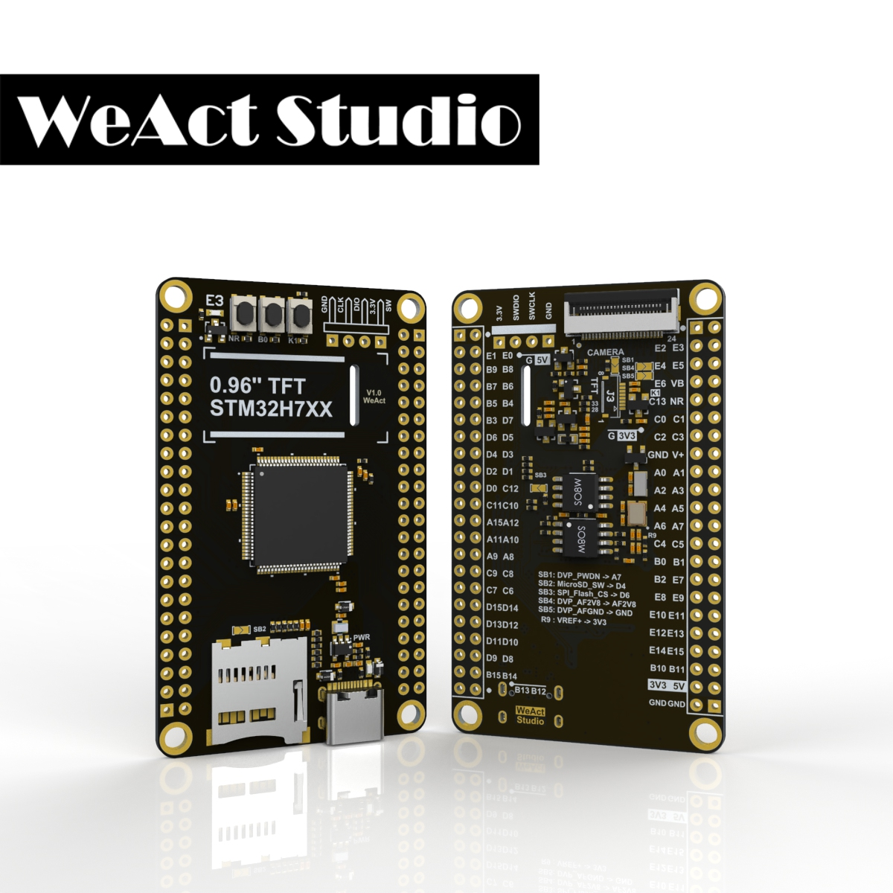

.. _coreboard_h743vi:

WeAct STM32H7xx Core Board
##########################

Overview
********

WeAct STM32H7xx Core Board is a minimal development board featuring a STM32H743
microcontroller.

Key Features:

- ...

Hardware
********

STM32H743VI Core Board provides the following hardware components:

- STM32H743VIT6 in LQFP144 package
   - 32-bit Arm Cortex-M7 core with double-precision FPU
   - 16 Kbytes of data and 16 Kbytes of instruction cache
   - Core frequency up to 480 MHz
   - 2 MB Internal Flash
   - 1 MB Internal SRAM
- 8MB NOR-Flash (QSPI) + 8MB NOR-Flash (SPI)
- 0.96" ST7735 TFT Display
- DCMI Connector
- uSD Card Slot

Supported Features
==================

The Zephyr `coreboard_h743vi` board configuration supports the following
hardware features:

+------------+------------+-------------------------------------+
| Interface  | Controller | Driver/Component                    |
+============+============+=====================================+
| NVIC       | on-chip    | nested vector interrupt controller  |
+------------+------------+-------------------------------------+
| PINMUX     | on-chip    | pinmux                              |
+------------+------------+-------------------------------------+
| UART       | on-chip    | serial port                         |
+------------+------------+-------------------------------------+
| GPIO       | on-chip    | gpio                                |
+------------+------------+-------------------------------------+
| RTC        | on-chip    | counter                             |
+------------+------------+-------------------------------------+
| I2C        | on-chip    | i2c                                 |
+------------+------------+-------------------------------------+
| PWM        | on-chip    | pwm                                 |
+------------+------------+-------------------------------------+
| ADC        | on-chip    | adc                                 |
+------------+------------+-------------------------------------+
| DAC        | on-chip    | DAC Controller                      |
+------------+------------+-------------------------------------+
| RNG        | on-chip    | True Random number generator        |
+------------+------------+-------------------------------------+
| SPI        | on-chip    | spi                                 |
+------------+------------+-------------------------------------+
| WATCHDOG   | on-chip    | independent watchdog                |
+------------+------------+-------------------------------------+
| USB        | on-chip    | usb_device                          |
+------------+------------+-------------------------------------+
| CAN/CANFD  | on-chip    | canbus                              |
+------------+------------+-------------------------------------+
| die-temp   | on-chip    | die temperature sensor              |
+------------+------------+-------------------------------------+

+-----------------+------+-----+-----+------+------------------+
| Signal          | GPIO | Pin | Pin | GPIO | Signal           |
+=================+======+=====+=====+======+==================+
| GND             |      | 1   | 2   |      | 5V               |
+-----------------+------+-----+-----+------+------------------+
| DCMI (D3)*      | PE1  | 3   | 4   | PE0  | DCMI (D2)*       |
+-----------------+------+-----+-----+------+------------------+
| I2C (SDA)       | PB9  | 5   | 6   | PB8  | I2C (SCL)        |
+-----------------+------+-----+-----+------+------------------+
| DCMI (VSYNC)*   | PB7  | 7   | 8   | PB6  | QSPI_FLASH (nCS) |
+-----------------+------+-----+-----+------+------------------+
|                 | PB5  | 9   | 10  | PB4  | SPI1 (MISO)      |
+-----------------+------+-----+-----+------+------------------+
| SPI1 (SCK)      | PB3  | 11  | 12  | PD7  | SPI1 (MOSI)      |
+-----------------+------+-----+-----+------+------------------+
| SPI_FLASH (nCS) | PD6  | 13  | 14  | PD5  |                  |
+-----------------+------+-----+-----+------+------------------+
|                 | PD4  | 15  | 16  | PD3  | DCMI (D5)*       |
+-----------------+------+-----+-----+------+------------------+
| SDMMC1 (CMD)    | PD2  | 17  | 18  | PD1  |                  |
+-----------------+------+-----+-----+------+------------------+
|                 | PD0  | 19  | 20  | PC12 | SDMMC1 (CK)      |
+-----------------+------+-----+-----+------+------------------+
| SDMMC1 (D3)     | PC11 | 21  | 22  | PC10 | SDMMC1 (D2)      |
+-----------------+------+-----+-----+------+------------------+
|                 | PA15 | 23  | 24  | PA12 | USB_FS (D+)      |
+-----------------+------+-----+-----+------+------------------+
| USB_FS (D-)     | PA11 | 25  | 26  | PA10 |                  |
+-----------------+------+-----+-----+------+------------------+
|                 | PA9  | 27  | 28  | PA8  | DCMI (XCLK)*     |
+-----------------+------+-----+-----+------+------------------+
| SDMMC1 (D1)     | PC9  | 29  | 30  | PC8  | SDMMC1 (D0)      |
+-----------------+------+-----+-----+------+------------------+
| DCMI (D1)*      | PC7  | 31  | 32  | PC6  | DCMI (D0)*       |
+-----------------+------+-----+-----+------+------------------+
|                 | PD15 | 33  | 34  | PD14 |                  |
+-----------------+------+-----+-----+------+------------------+
| QSPI (IO3)      | PD13 | 35  | 36  | PD12 | QSPI (IO1)       |
+-----------------+------+-----+-----+------+------------------+
| QSPI (IO0)      | PD11 | 37  | 38  | PD10 |                  |
+-----------------+------+-----+-----+------+------------------+
|                 | PD9  | 39  | 40  | PD8  |                  |
+-----------------+------+-----+-----+------+------------------+
|                 | PB15 | 41  | 42  | PB14 |                  |
+-----------------+------+-----+-----+------+------------------+
|                 | PB13 | 43  | 44  | PB12 |                  |
+-----------------+------+-----+-----+------+------------------+

+---------------+------+-----+-----+------+--------------+
| Signal        | GPIO | Pin | Pin | GPIO | Signal       |
+===============+======+=====+=====+======+==============+
| GND           |      | 1   | 2   |      | 3V3          |
+---------------+------+-----+-----+------+--------------+
| QSPI (IO2)    | PE2  | 3   | 4   | PE3  | LED (E3)     |
+---------------+------+-----+-----+------+--------------+
| DCMI (D4)*    | PE4  | 5   | 6   | PE5  | DCMI (D6)*   |
+---------------+------+-----+-----+------+--------------+
| DCMI (D7)*    | PE6  | 7   | 8   |      | VBAT         |
+---------------+------+-----+-----+------+--------------+
| BTN (K1)      | PC13 | 9   | 10  |      | nRST         |
+---------------+------+-----+-----+------+--------------+
|               | PC0  | 11  | 12  | PC1  |              |
+---------------+------+-----+-----+------+--------------+
|               | PC2  | 13  | 14  | PC3  |              |
+---------------+------+-----+-----+------+--------------+
| GND           |      | 15  | 16  |      | VREF+        |
+---------------+------+-----+-----+------+--------------+
|               | PA0  | 17  | 18  | PA1  |              |
+---------------+------+-----+-----+------+--------------+
| USART2 (TX)   | PA2  | 19  | 20  | PA3  | USART2 (RX)  |
+---------------+------+-----+-----+------+--------------+
| DCMI (HSYNC)* | PA4  | 21  | 22  | PA5  |              |
+---------------+------+-----+-----+------+--------------+
| DCMI (PCLK)*  | PA6  | 23  | 24  | PA7  | DCMI (PWDN)* |
+---------------+------+-----+-----+------+--------------+
|               | PC4  | 25  | 26  | PC5  |              |
+---------------+------+-----+-----+------+--------------+
|               | PB0  | 27  | 28  | PB1  |              |
+---------------+------+-----+-----+------+--------------+
| QSPI (CLK)    | PB2  | 29  | 30  | PE7  |              |
+---------------+------+-----+-----+------+--------------+
|               | PE8  | 31  | 32  | PE9  |              |
+---------------+------+-----+-----+------+--------------+
| LCD (BL)      | PE10 | 33  | 34  | PE11 | LCD (nCS)    |
+---------------+------+-----+-----+------+--------------+
| SPI4 (SCK)    | PE12 | 35  | 36  | PE13 | LCD (DATA)   |
+---------------+------+-----+-----+------+--------------+
| SPI4 (MOSI)   | PE14 | 37  | 38  | PE15 |              |
+---------------+------+-----+-----+------+--------------+
|               | PB10 | 39  | 40  | PB11 |              |
+---------------+------+-----+-----+------+--------------+
| 3V3           |      | 41  | 42  |      | 5V           |
+---------------+------+-----+-----+------+--------------+
| GND           |      | 43  | 44  |      | GND          |
+---------------+------+-----+-----+------+--------------+

*: Only if attached

Programming and Debugging
*************************

Flashing
========

Debugging
=========

References
**********

.. target-notes::

.. _Board resources:
   https://github.com/WeActStudio/MiniSTM32H7xx

.. _STM32H743VI website:
   https://www.st.com/en/microcontrollers-microprocessors/stm32h743vi.html

.. _STM32H743 reference manual:
   https://www.st.com/resource/en/reference_manual/dm00314099.pdf
